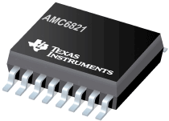

# Qwiic Fan Control Module

-----

| **&#9888; WARNING &#9888;** |
|:---------------------------:|
| The v2.3 design does not work.  There is a flaw in the PWM design that I cannot resolve yet. |

-----

- This is the **EAGLE** *PCB* design project
- For the **Arduino** *code* library please see [Tecsmith](https://github.com/Tecsmith)/[Tecsmith_AMC6821](https://github.com/Tecsmith/Tecsmith_AMC6821)

AMC6821 based Fan Control Module with Qwiic connectors for integration into 3.3V MCU projects.

| &#8505; | URL |
|--------:|-----|
| Project website | [tecsmith.github.io/arduino-fan-control](https://tecsmith.github.io/arduino-fan-control/) |
| Quick link | [`c1k.it/amc6`](http://c1k.it/amc6) |
| Github EAGLE-CAD Source | https://github.com/Tecsmith/arduino-fan-control/tree/master/EAGLE |
| Github PlatformIO Source | https://github.com/Tecsmith/arduino-fan-control/tree/master/PLatformIO |

## About

Thermal control is often arbitrarily implemented in electronics projects – adoption of fans for heat management is often done without consideration for power consumption or acoustic noise.

Leveraging the Texas Instruments AMC6821 chip, this module adds an intelligent temperature monitor and pulse-width modulation (PWM) fan controller to a fan. It is designed for noise-sensitive or power-sensitive applications that require active system cooling. Using a PWM signal, this device simultaneously drives a fan, monitors remote sensor diode temperatures, and measures/controls the fan speed so that it operates with minimal acoustic noise at the lowest possible speed.

This project is an Open Source Hardware (OSH) project and is based on [SparkFun's Qwiic](https://www.sparkfun.com/qwiic) I2C connectors and can be integrated into many 3.3V based MCU's.

## AMC6821
### Intelligent temperature monitor and pulse-width modulation fan controller

The AMC6821 is an intelligent temperature monitor and pulse-width modulation (PWM) fan controller. It is designed for noise-sensitive or power-sensitive applications that require active system cooling. Using a low-frequency or a high-frequency PWM signal, this device can simultaneously drive a fan, monitor remote sensor diode temperatures, and measure and control the fan speed so that it operates with minimal acoustic noise at the lowest possible speed.

The AMC6821 has three fan control modes: *Auto Temperature-Fan* mode, *Software-RPM* mode, and *Software-DCY* mode. Each mode controls the fan speed by changing the duty cycle of a PWM output.

- <u>**Auto Temperature-Fan**</u> mode is an intelligent, closed-loop control that optimizes fan speed according to user-defined parameters. This mode allows the AMC6821 to run as a stand-alone device without CPU intervention; the fan can continue to be controlled (based on temperature measurements) even if the CPU or system locks up.

- <u>**Software-RPM**</u> mode is a second closed-loop control. In this mode, the AMC6821 adjusts the PWM output to maintain a consistent fan speed at a user-specified target value; that is, the device functions as a fan speed regulator. Software-RPM mode can also be used to allow the AMC6821 to operate as a stand-alone device.

- <u>**Software-DCY**</u> is the third mode and is open-loop. In Software-DCY mode, the PWM duty cycle is set directly by the value written to the device.

The AMC6821 also has a programmable `SMBALERT` output to indicate error conditions and a dedicated `FAN-FAULT` output to indicate fan failure. The `THERM` pin is a fail-safe output for over-temperature conditions that can be used to throttle a CPU clock. Additionally, the `OVR` pin indicates the over-temperature limit as well. All of the alarm thresholds are set through the device registers. The AMC6821 is available in a QSOP-16 package.

## Project Features

- Designed to be an inline series add-on for existing fan implementations.
- Can be powered from 12V and/or 5V power sources. _(Dependant on Fan required operational voltage.)_
- Support most fan types, 5V~ and 12V
  * 4-wire _(Tachometer + PWM)_
  * 3-wire _(Tachometer Sensor)~_
  * 3-wire _(Locked Rotor Sensor)~_
  * 2-wire~
- Can be run as standalone module.
- Can be chained for up to 9 fans, depending on I2C addresses set at A0 and A1 pins.
- Both Qwiic and generic I2C headers for communication with 3.3V based MCU boards.

_ ~ = with add-on MOSFET _

----------

&#9733;
