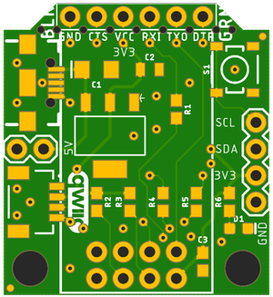
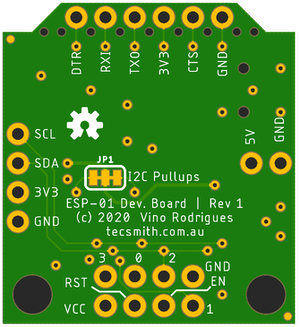

ESP-01 Qwiic Development Board
==============================

- GitHub repository here: [github.com/Tecsmith/arduino-fan-control-v2](https://github.com/Tecsmith/arduino-fan-control-v2)

Specifications
--------------

- Host of ESP-01 (or ESP-01S) module.
- Powered from USB Micro-B connector
- Serial programing breakout pins (for use with SparkFun FTDI 3.3V Breakout)
- I2C breakout pins (SCL, SDA, 3V3, GND)
- Qwiic connector (works with SparkFun's [Qwiic Connect System](https://www.sparkfun.com/qwiic))
- Tactile momentary button (press to set ESP8266 into programming mode)
- Unlike common designs, this uses GPIO-0/GPIO-2 for I2C, leaving TX/RX (GPIO-1/GPIO-3) available for serial debug.

ESP-01 Pinout
-------------

DevBrd | ESP | Pin | Pin | ESP | DevBrd
---|---|---|---|---|---|
RXI | GPIO-3 / RX | **5** | **4** | VCC (3.3V) | 3V3
SCL | GPIO-0 | **6** | **3** | RST | Reset
SDA | GPIO-2 | **7** | **2** | CH_PD/EN | Enable
GND | GND | **8** | **1** | GPIO-1 / TX | TXO

On Board Jumpers
----------------

### JP1 - I2C Pull Ups
- Connected _(default)_: 3.3KΩ pullups
- Cut both sides: No pullups

Manufacturing
-------------

 

Initial prototype built by JCLPCB.com

★

