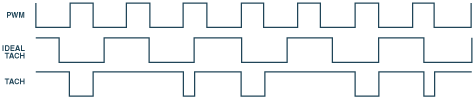
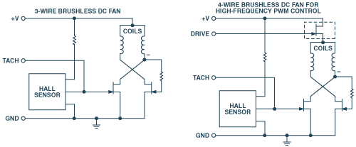
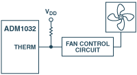
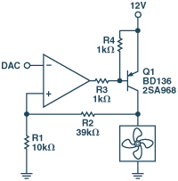
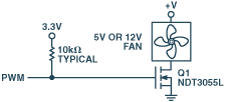
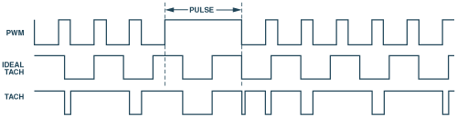
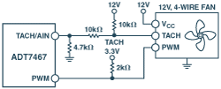

# Why and How to Control Fan Speed for Cooling Electronic Equipment
***by Mary Burke*** 
*February 2004*

> Original publication at [AnalogDialogue / analog.com](https://www.analog.com/en/analog-dialogue/articles/how-to-control-fan-speed.html) 
> [Download PDF](https://www.analog.com/media/en/analog-dialogue/volume-38/number-1/articles/how-to-control-fan-speed.pdf)

## Introduction

Interest has been growing in integrated circuits for controlling the speed of cooling fans in personal computers and other electronic equipment. Compact electrical fans are cheap and have been used for cooling electronic equipment for more than half a century. However, in recent years, the technology of using these fans has evolved significantly. This article will describe how and why this evolution has taken place and will suggest some useful approaches for the designer.

## Heat Generation and Removal

The trend in electronics, particularly consumer electronics, is towards smaller products with enhanced combinations of features. Consequently, lots of electronic components are being shoehorned into very small form factors. An obvious example is the notebook PC. Thin and “Lite,” notebook PCs have shrunk significantly, yet their processing power has been maintained or increased. Other examples of this trend include projection systems and set-top boxes. What these systems all have in common, besides significantly smaller—and still decreasing—size, is that the amount of heat they must dissipate does not decrease; often it increases! In the notebook PC, much of the heat is generated by the processor; in the projector, most of the heat is generated by the light source. This heat needs to be removed quietly and efficiently.

The quietest way to remove heat is with passive components such as heat sinks and heat pipes. However, these have proved insufficient in many popular consumer electronics products—and they are also somewhat expensive. A good alternative is active cooling, introducing a fan into the system to generate airflow around the chassis and the heat-generating components, efficiently removing heat from the system. A fan is a source of noise, however. It is also an additional source of power consumption in the system—a very important consideration if power is to be supplied by a battery. The fan is also one more mechanical component in the system, not an ideal solution from a reliability standpoint.

*Speed control* — one way to answer some of these objections to the use of a fan—can have these advantages:

1. running a fan slower reduces the noise it emits,
2. running a fan slower can reduce the power it consumes,
3. running a fan slower increases its reliability and lifetime.

There are many different types of fans and ways of controlling them. We will discuss here various fan types and the advantages and disadvantages of control methods in use today. One way to classify fans is as:

1. 2-wire fans
2. 3-wire fans 
3. 4-wire fans.

The methods of fan control to be discussed here include:

1. no fan control
2. on/off control
3. linear (continuous dc) control
4. low-frequency pulse-width modulation (PWM)
5. high-frequency fan control.

## Fan Types

A 2-wire fan has power and ground terminals. A 3-wire fan has power, ground, and a tachometric (“tach”) output, which provides a signal with frequency proportional to speed. A 4-wire fan has power, ground, a tach output, and a PWM-drive input. PWM, in brief, uses the relative width of pulses in a train of on-off pulses to adjust the level of power applied to the motor.

A 2-wire fan is controlled by adjusting either the dc voltage or pulse width in low-frequency PWM. However, with only two wires, a tach signal is not readily available. This means that there is no indication as to how fast the fan is running—or indeed, if it is running at all. This form of speed control is open-loop.

A 3-wire fan can be controlled using the same kind of drive as for 2-wire fans—variable dc or low-frequency PWM. The difference between 2-wire fans and 3-wire fans is the availability of feedback from the fan for closed-loop speed control. The tach signal indicates whether the fan is running and its rate of speed.

The tach signal, when driven by a dc voltage, has a square-wave output closely resembling the “ideal tach” in Figure 1. It is always valid, since power is continuously applied to the fan. With low- frequency PWM, however, the tach signal is valid only when power is applied to the fan—that is, during the on phase of the pulse. When the PWM drive is switched to the off phase, the fan’s internal tach signal-generation circuitry is also off. Because the tach output is typically from an open drain, it will float high when the PWM drive is off, as shown in Figure 1. Thus, while the ideal tach is representative of the actual speed of the fan, the PWM drive in effect “chops” the tach signal output and may produce erroneous readings.

<figure>
  
  <figcaption>Figure 1. Tachometer-output waveform in 3-wire fans—ideal, and under PWM control.</figcaption>
</figure>

In order to be sure of a correct fan speed reading under PWM control, it is necessary to periodically switch the fan on long enough to get a complete tach cycle. This feature is implemented in a number of Analog Devices fan controllers, such as the ADM1031 and the ADT7460.

In addition to the power, ground, and tach signal, 4-wire fans have a PWM input, which is used to control the speed of the fan. Instead of switching the power to the entire fan on and off, only the power to the drive coils is switched, making the tach information available continuously. Switching the coils on and off generates some commutation noise. Driving the coils at rates greater than 20 kHz moves the noise outside of the audible range, so typical PWM fan-drive signals use a rather high frequency (>20 kHz). Another advantage of 4-wire fans is that the fan speed can be controlled at speeds as low as 10% of the fan’s full speed. Figure 2 shows the differences between 3-wire and 4-wire fan circuits.

<figure>
  
  <figcaption>Figure 2. 3- and 4-wire fans.</figcaption>
</figure>

## Fan Control

No control: The simplest method of fan control is not to use any at all; just run a fan of appropriate capacity at full speed 100% of the time. The main advantages of this are guaranteed fail-safe cooling and a very simple external circuit. However, because the fan is always switched on, its lifetime is reduced and it uses a constant amount of power—even when cooling is not needed. Also, its incessant noise is likely to be annoying.

On/off control: The next simplest method of fan control is thermostatic, or on/off control. This method is also very easy to implement. The fan is switched on only when cooling is needed, and it is switched off for the remainder of the time. The user needs to set the conditions under which cooling is needed—typically when the temperature exceeds a preset threshold.

The Analog Devices ADM1032 is an ideal sensor for on/off fan control using a temperature setpoint. It has a comparator that produces a THERM output—one that is normally high but switches low when the temperature exceeds a programmable threshold. It automatically switches back to high when the temperature drops a preset amount below the THERM Limit. The advantage of this programmable hysteresis is that the fan does not continually switch on/off when the temperature is close to the threshold. Figure 3 is an example of a circuit using the ADM1032.

<figure>
  
  <figcaption>Figure 3. Example of an on/off control circuit.</figcaption>
</figure>

The disadvantage of on/off control is that it is very limited. When a fan is switched on, it immediately spins up to its full speed in an audible and annoying manner. Because humans soon become somewhat accustomed to the sound of the fan, its switching off is also very noticeable. (It can be compared to the refrigerator in your kitchen. You didn’t notice the noise it was making until it switched off.) So from an acoustic perspective, on/off control is far from optimal.

**Linear control:** At the next level of fan control, linear control, the voltage applied to the fan is variable. For lower speed (less cooling and quieter operation) the voltage is decreased, and for higher speed it is increased. The relationship has limitations. Consider, for example, a 12-V fan (rated maximum voltage). Such a fan may require at least 7 V to start spinning. When it does start spinning, it will probably spin at about half its full speed with 7 V applied. Because of the need to overcome inertia, the voltage required to start a fan is higher than the voltage required to keep it spinning. So as the voltage applied to the fan is reduced, it may spin at slower speeds until, say, 4 V, at which point it will stall. These values will differ, from manufacturer to manufacturer, from model to model, and even from fan to fan.

The Analog Devices ADM1028 linear fan-control IC has a programmable output and just about every feature that might be needed in fan control, including the ability to interface accurately to the temperature-sensing diode provided on chips, such as microprocessors, that account for most of the dissipation in a system. (The purpose of the diode is to provide a rapid indication of critical junction temperatures, avoiding all the thermal lags inherent in a system. It permits immediate initiation of cooling, based on a rise in chip temperature.) In order to keep the power used by the ADM1028 at a minimum, it operates on supply voltages from 3.0 V to 5.5 V, with +2.5-V full scale output.

5-V fans allow only a limited range of speed control, since their start-up voltage is close to their 5-V full speed level. But the ADM1028 can be used with 12-V fans by employing a simple step-up booster amplifier with a circuit such as that shown in Figure 4.

<figure>
  
  <figcaption>Figure 4. Boost circuit for driving a 12-V fan, using the output from the linear fan-control ADM1028’s DAC.</figcaption>
</figure>

The principal advantage of linear control is that it is quiet. However, as we have noted, the speed-control range is limited. For example, a 12-V fan with a control voltage range from 7 V to 12 V could be running at half speed at 7 V. The situation is even worse with a 5-V fan. Typically, 5-V fans will require that 3.5 V or 4 V be applied to get them started, but at that voltage they will be running at close to full speed, with a very limited range of speed control. But running at 12 V, using circuits such as that shown in Figure 4, is far from optimum from an efficiency perspective. That is because the boost transistor dissipates a relatively large amount of power (when the fan is operating at 8 V, the 4-V drop across the transistor is not very efficient). The external circuit required is also relatively expensive.

**PWM Control:** The prevalent method currently used for controlling fan speed in PCs is low-frequency PWM control. In this approach, the voltage applied to the fan is always either zero or full-scale—avoiding the problems experienced in linear control at lower voltages. Figure 5 shows a typical drive circuit used with PWM output from the ADT7460 thermal voltage controller.

<figure>
  
  <figcaption>Figure 5. A low-frequency PWM fan-drive circuit.</figcaption>
</figure>

The principal advantage of this drive method is that it is simple, inexpensive, and very efficient, since the fan is either fully on or fully off.

A disadvantage is that the tach information is chopped by the PWM drive signal, since power is not always applied to the fan. The tach information can be retrieved using a technique called pulse stretching—switching the fan on long enough to gather the tach information (with a possible increase of audible noise). Figure 6 shows a case of pulse stretching.

<figure>
  
  <figcaption>Figure 6. Pulse stretching to gather tach information.</figcaption>
</figure>

Another disadvantage of low-frequency PWM is commutation noise. With the fan coils continuously switched on and off, audible noise may be present. To deal with this noise, the newest Analog Devices fan controllers are designed to drive the fan at a frequency of 22.5 kHz, which is outside the audible range. The external control circuit is simpler with high-frequency PWM, but it can only be used with 4-wire fans. Although these fans are relatively new to the market, they are rapidly becoming more popular. Figure 7 depicts the circuit used for high-frequency PWM.

<figure>
  
  <figcaption>Figure 7. Circuit for driving a fan with high-frequency PWM.</figcaption>
</figure>

The PWM signal drives the fan directly; the drive FET is integrated inside the fan. Reducing the external component count, this approach makes the external circuit much simpler. Since the PWM drive signal is applied directly to the coils of the fan, the fan’s electronics are always powered on, and the tach signal is always available. This eliminates the need for pulse stretching—and the noise it can produce. The commutation noise is also eliminated, or reduced significantly, since the coils are being switched with a frequency outside the audible range.

## Summary

From the standpoints of acoustic noise, reliability, and power efficiency, the most preferable method of fan control is the use of high-frequency (>20 kHz) PWM drive.

Besides eliminating the need for noisy pulse stretching and the commutation noise associated with low-frequency PWM, it has a much wider control range than linear control. With high- frequency PWM, the fan can be run at speeds as low as 10% of full speed, while the same fan may only run at a minimum of 50% of full speed using linear control. It is more energy efficient, because the fan is always either fully on or fully off. (With the FET either off or in saturation, its dissipation is very low, eliminating the significant losses in the transistor in the linear case.) It is quieter than always-on or on/off control, since the fan can run at lower speeds—that can be varied gradually. Finally, running the fan slower also improves its lifetime, increasing system reliability.

| Control Method | Advantages | Disadvantages |
|:--------------:|:-----------|:--------------|
| On/Off | Inexpensive | Worst acoustic performance—fan is always running. |
| Linear | Most quiet | Expensive circuit   Inefficient—loss of power in the amplifier circuit |
| Low-Frequency PWM | Efficient   Wide speed-control range when measuring speed | Fan commutation noise   Pulse stretching required |
| High-Frequency PWM | Efficient   Good acoustics, almost as good as linear.   Inexpensive external circuit   Wide speed-control range |  Must use 4-wire fans |

★

> &copy; Analog Dialogue 38-02, February (2004), accessed from https://www.analog.com/en/analog-dialogue/articles/how-to-control-fan-speed.html, accessed 19 July 202 
> PDF available from https://www.analog.com/media/en/analog-dialogue/volume-38/number-1/articles/how-to-control-fan-speed.pdf
