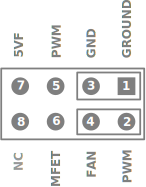
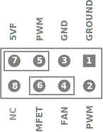
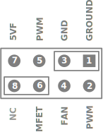
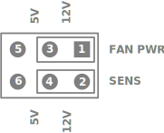
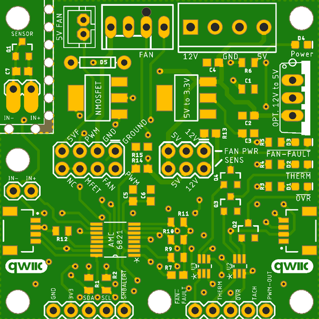
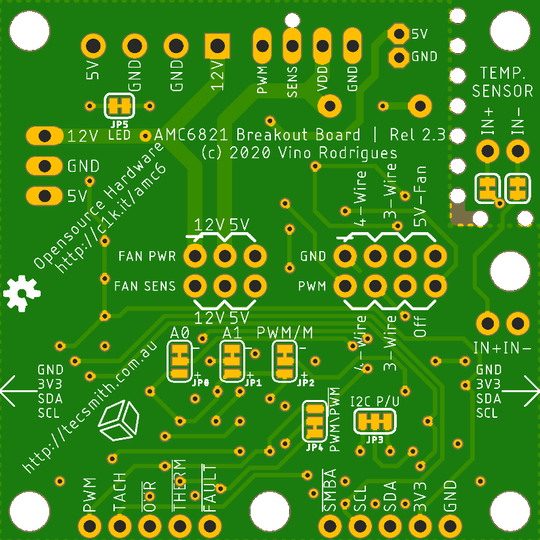

# Qwiic Fan Control Module

-----

| **&#9888; WARNING &#9888;** |
|:---------------------------:|
| The v2.3 design does not work.  There is a flaw in the PWM design that I cannot resolve yet. |

-----

AMC6821 based Fan Control Module with Qwiic connectors for integration into 3.3V MCU projects.

GitHub repository at [Tecsmith/arduino-fan-control-v2](https://github.com/Tecsmith/arduino-fan-control-v2)

## Features / Specifications

- Host for [Texas Instruments AMC6821](https://www.ti.com/lit/gpn/amc6821) Intelligent Temperature Monitor and PWM Fan Controller
- Can operate in two modes:
  - Standalone
  - Integrated (via Qwiic connectors) with 3.3V based MCU's
- Powered from 12V + 5V power supply
  * or just 12V with optional 12V-to-5V ("7805" IC or Pololu 5V Step-Down) regulator
  * or just 5V for 5V fans
- I2C breakout pins (SCL, SDA, 3V3, GND)
  * on board 3.3KΩ pullups, disable by cutting JP1
- AMC6821 breakout pins (PWM, TACH, <u>OVR</u>, <u>THERM</u>, <u>FAN-FAULT</u>, <u>SMBALERT</u>)
- Power LED (green)
- Error LEDs (red) (OVR, THERM, FAN-FAULT)
- 2x Qwiic connector (works with SparkFun's [Qwiic Connect System](https://www.sparkfun.com/qwiic))
- Supports 2x PWM Modes
- Supports 9x I2C Addresses
- Supports most industry FAN types
  - JST 2-wire connector
    * 5V, 2-wire
  - Molex 4-wire KK-254-47053-1000 connector
    * 12V, 2-wire
    * 12V, 3-wire, with Tachometer
    * 12V, 3-wire, with Rotor-Lock
    * 12V PWM, 4-wire, with Tachometer & PWM control
- Includes on board Temperature sensor
  * can be isolated (cut JP5 and JP6) for BYO sensor
  * can be cut out for remote installation (use rotary cutter along drill holes)

----------

## On Board Jumpers

- *(Items marked &#9734; are the default.)*

### JP0 & JP1 - _{A0 & A1}_ - I2C Address Selector

| A0 / JP0 | A1 / JP1 |  7-bit  |   Hex  | Address      |
|:--------:|:--------:|:-------:|:------:|:-------------|
|   GND    |   GND    | 0011000 | `0x18` | 24 *&#9734;* |
|   3V3    |   GND    | 0011001 | `0x19` | 25           |
|   *N/C*  |   GND    | 0011010 | `0x1A` | 26           |
|   GND    |   3V3    | 1001100 | `0x4C` | 76           |
|   3V3    |   3V3    | 1001101 | `0x4D` | 77           |
|   *N/C*  |   3V3    | 1001110 | `0x4E` | 78           |
|   GND    |   *N/C*  | 0101100 | `0x2C` | 44           |
|   3V3    |   *N/C*  | 0101001 | `0x2D` | 45           |
|   *N/C*  |   *N/C*  | 0101110 | `0x2E` | 46           |

### JP2 - _{PWM/M}_ - PWM Mode (for Frequency selection)

|     JP2     | PWM Mode                                              |
|:-----------:|:------------------------------------------------------|
| Tied to GND | High Frequency range, 1kHz to 40kHz *(&#9734; 25kHz)* |
| Tied to 3V3 | Low Frequency range, 10Hz to 94Hz                     |

- Actual PWM Frequency depends on Fan Characteristics Register, bits 3-5

### JP3 - _{I2C P/U}_ - I2C Pullups

|     JP3        | I2C Pullups  |
|:--------------:|:------------------------|
| Both connected | 4.7KΩ pullups *&#9734;* |
| Cut both sides | No pullups              |

- I2C Bus should have at least one set of pullups.

### JP4 - _{PWM\\<u>PWM</u>}_ - PWM Inversion selection

|         JP4          | PWM Mode                          |
|:--------------------:|:----------------------------------|
| Tied to `PWM`        | PWM from AMC6821 *&#9734;*        |
| Tied to <u>`PWM`</u> | PWM inverted from Schmitt-trigger |
| Both cut             | PWM disabled                      |

- &#9888; Both sides tied = PWM shorted, unpredictable behavior to Schmitt-trigger possible
- <u>`PWM`</u> = word "PWM" with overline

### JP5 - Power LED

|  JP5  | LED function                             |
|:-----:|:-----------------------------------------|
| Tied  | LED active to show power state *&#9734;* |
| Cut   | Power LED disabled                       |

### JP6 & JP7 - Optional Temperature Sensor

| JP6 & JP7 | Onboard sensor mode                                 |
|:---------:|:----------------------------------------------------|
| Both tied | Sensor enabled *&#9734;*                            |
| Both cut  | Sensor disabled, use J14 to connect external sensor |

- ***Not marked***, located under remote sensor cutout, near `IN+` & `IN-` pins

### FAN Wire Selection Header _(JP8)_

As viewed from top:

#### For 12V PWM FAN _(4-wire)_ *&#9733;*

| Row |  Pins 7 & 8   |  Pins 5 & 6   |  Pins 3 & 4   |  Pins 1 & 2   | Function              | 
|----:|:-------------:|:-------------:|:-------------:|:-------------:|:----------------------|
| GND |    &middot;   |    &middot;   | **[&middot;** | **&middot;]** | FAN GND direct to GND |
| PWM |    &middot;   |    &middot;   | **[&middot;** | **&middot;]** | PWM sent to pin 4     |

#### For 12V non-PWM FANs _(3-wire & 2-wire variants)_

| Row |  Pins 7 & 8   |  Pins 5 & 6   |  Pins 3 & 4   |  Pins 1 & 2   | Function              | 
|----:|:-------------:|:-------------:|:-------------:|:-------------:|:----------------------|
| GND |    &middot;   | **[&middot;** | **&middot;]** | &middot; | FAN GND to MOSFET Drain    |
| PWM |    &middot;   | **[&middot;** | **&middot;]** | &middot; | PWM sent to MOSFET         |

#### 5V FAN _(2-wire)_

| Row |  Pins 7 & 8   |  Pins 5 & 6   |  Pins 3 & 4   |  Pins 1 & 2   | Function              | 
|----:|:-------------:|:-------------:|:-------------:|:-------------:|:----------------------|
| GND | **[&middot;** | **&middot;]** |    &middot;   |    &middot;   | 5V FAN GND to MOSFET Drain  _(12V FAN GND disabled)_ |
| PWM |    &middot;   | **[&middot;** | **&middot;]** |    &middot;   | PWM sent to MOSFET    |

#### Disable PWM

| Row |  Pins 7 & 8   |  Pins 5 & 6   |  Pins 3 & 4   |  Pins 1 & 2   | Function              | 
|----:|:-------------:|:-------------:|:-------------:|:-------------:|:----------------------|
| GND |    &middot;   |    &middot;   | **[&middot;** | **&middot;]** | FAN GND direct to GND |
| PWM | **[&middot;** | **&middot;]** |    &middot;   |    &middot;   | No connection         |

### FAN Power Header _(JP9)_

As viewed from top:

#### For 12V FANS *&#9733;*

|  Row    |  Pins 5 & 7   | Pins 3 & 4    | Pins 1 & 2    | Function                          |
|--------:|:-------------:|:-------------:|:-------------:|:----------------------------------|
| FAN PWR |    &middot;   | **[&middot;** | **&middot;]** | 12V line tied to FAN Header pin 2 |
| SENS    |    &middot;   | **[&middot;** | **&middot;]** | 12V line tied to FAN Header pin 3 (Sens)  via V-div 10KΩ pull-up |

#### For 5V FANS

|  Row    |  Pins 5 & 6   | Pins 3 & 4    | Pins 1 & 2    | Function                         |
|--------:|:-------------:|:-------------:|:-------------:|:---------------------------------|
| FAN PWR | **[&middot;** | **&middot;]** |    &middot;   | 5V line tied to FAN Header pin 2 |
| SENS    | **[&middot;** | **&middot;]** |    &middot;   | 5V line tied to FAN Header pin 3 (Sens) _(no pull-up)_

----------

## Manufacturing

* Schematic print: [amc6821-breakout-v2.3.pdf](amc6821-breakout-v2.3.pdf)
* Schematic source (in EAGLE): [Tecsmith/arduino-fan-control-v2/EAGLE/amc6821-breakout-v2.3.sch](https://github.com/Tecsmith/arduino-fan-control-v2/blob/master/EAGLE/amc6821-breakout-v2.3.sch)
* PCB design (in EAGLE): [Tecsmith/arduino-fan-control-v2/EAGLE/amc6821-breakout-v2.3.brd](https://github.com/Tecsmith/arduino-fan-control-v2/blob/master/EAGLE/amc6821-breakout-v2.3.brd)
* GERBER files: [Tecsmith/arduino-fan-control-v2/GERBER](https://github.com/Tecsmith/arduino-fan-control-v2/tree/master/GERBER)

|              Top             |             Bottom           |
|:----------------------------:|:----------------------------:|
|  |  |

2nd prototype built by JCLPCB

----------

## Source Code

Currently under development ... refer to:

* PlatfromIO examples: [Tecsmith/arduino-fan-control-v2/PlatformIO](https://github.com/Tecsmith/arduino-fan-control-v2/tree/master/PlatformIO)

----------

★

