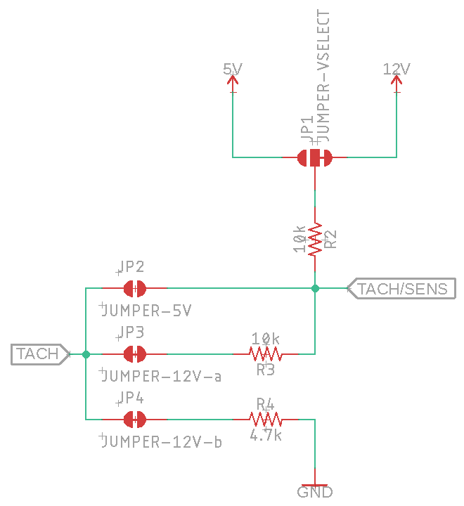
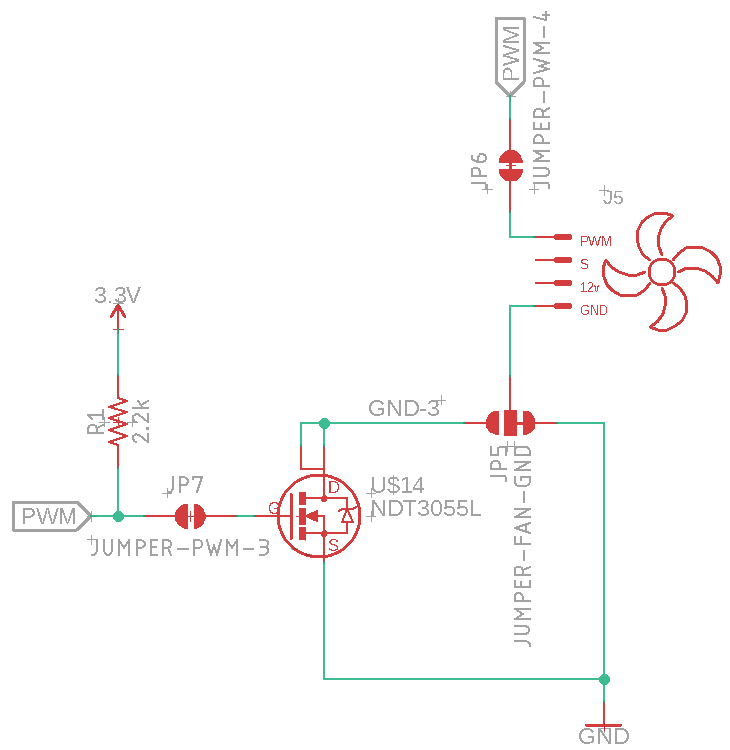
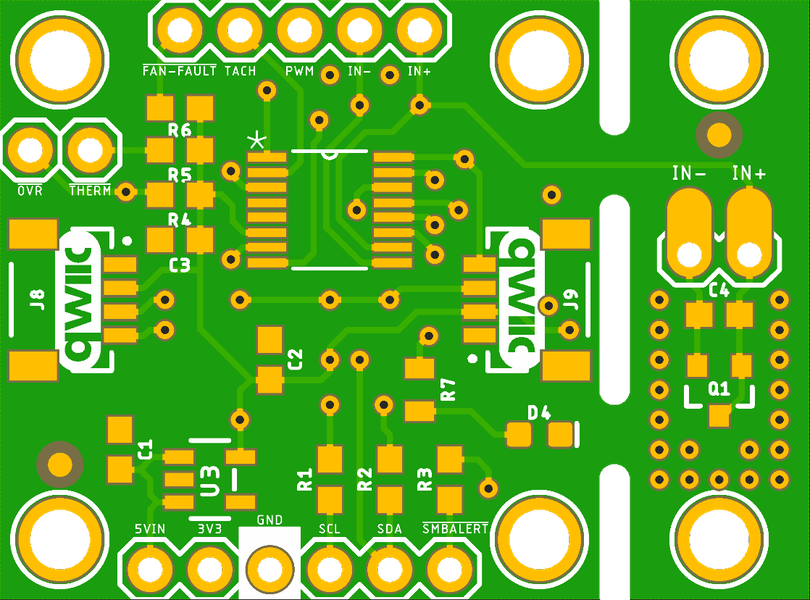
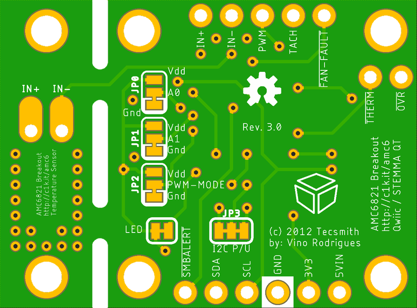
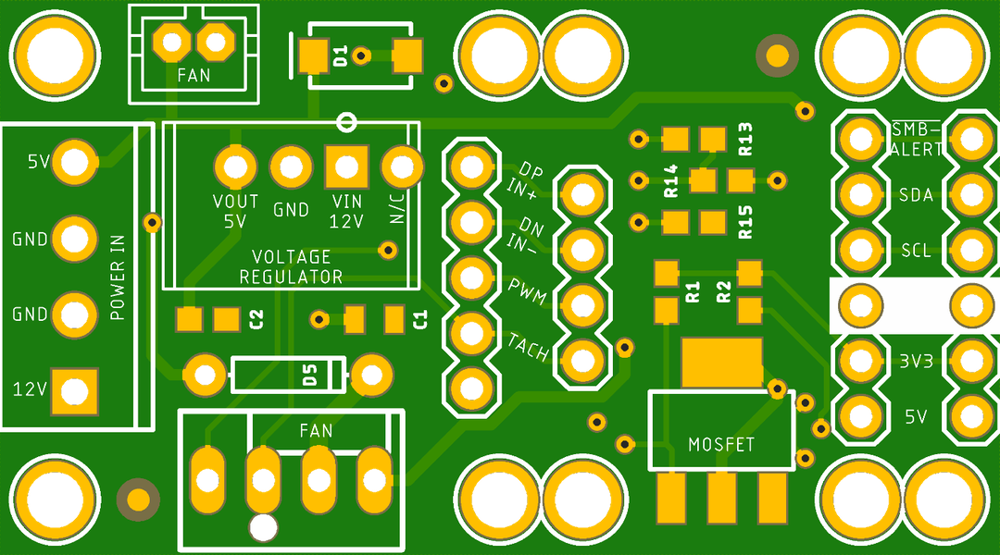
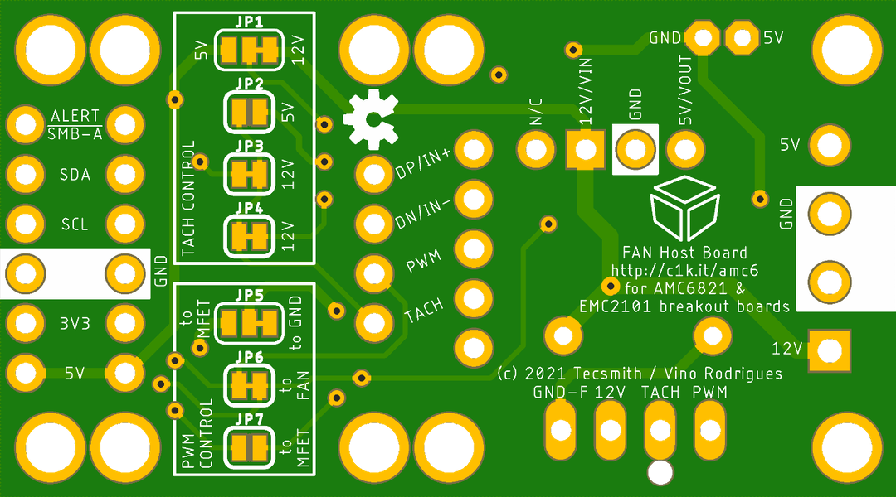

# Qwiic Fan Control Module

AMC6821 based Fan Control Module with Qwiic connectors for integration into 3.3V MCU projects.

GitHub repository at [Tecsmith/arduino-fan-control](https://github.com/Tecsmith/arduino-fan-control)

## Features / Specifications

This project contains 2 PCB boards:
* AMC6821 Breakout Board, *allowing intergration via I2C to:*
  * [ESP-01 dev board](https://github.com/Tecsmith/arduino-esp-01-dev-board),
  * [Pro-Micro screw terminal board](https://github.com/Tecsmith/arduino-pro-micro-screw-terminal),
  * [Wemos D1 Mini screw terminal board](https://github.com/Tecsmith/arduino-wemos-d1-screw-terminal), and
  * Many other MCU boards from your favorite suppliers, like:
    * [SparkFun](https://www.sparkfun.com/search/results?term=qwiic) Qwiic *[Niwot, Colorado, USA]*
    * [AdaFruit](https://www.adafruit.com/?q=STEMMA+QT) STEMMA QT *[NYC, New York, USA]*
    * [Smart Prototyping](https://www.smart-prototyping.com/index.php?route=product/search&search=qwiic) *[Hong Kong & Shenzhen, China]*
    * [Core Electronics](https://core-electronics.com.au/search/?q=piicodev) PiicoDev *[Hunter Valley, Australia]*
* Fan Host Board, *supporting:*
  * The above [AMC6821 Breakout Board](#), and
  * the [Adafruit EMC2101 Breakout Board](https://www.adafruit.com/product/4808)

### AMC6821 Breakout Board

- Host for [Texas Instruments AMC6821](https://www.ti.com/lit/gpn/amc6821) Intelligent Temperature Monitor and PWM Fan Controller
- Integrates into other 3.3V based MCUs (via Qwiic / STEMMA QT connectors) 
- I2C breakout pins (SCL, SDA, 3V3, GND)
  * on board 2.2KΩ pullups, disable by cutting jumpers
- AMC6821 breakout pins (PWM, TACH, <u>FAN-FAULT</u> and <u>SMBALERT</u>. <u>OVR</u> and <u>THERM</u> are also available.)
- Power LED (green)
- 2x Qwiic connector (works with SparkFun's [Qwiic Connect System](https://www.sparkfun.com/qwiic), or Adafruit's [STEMMA QT](https://www.adafruit.com/?q=stemma+qt))
- Supports 2x PWM Modes (via Jumper)
- Supports 9x I2C Addresses (via Jumper)
- Includes an on board Temperature sensor
  * can be cut out for remote installation (use rotary cutter along break line)

### Fan Host Board

- Powered from 12V + 5V power supply
  * or just 12V with optional 12V-to-5V ("7805" IC or Pololu 5V Step-Down) regulator
  * or just 5V for 5V fans
- Supports most industry FAN types
  - Molex 4-wire `KK-254-47053-1000` connector
    * 12V PWM, 4-wire, with Tachometer & PWM control
    * 12V, 3-wire, with Tachometer
    * 12V, 3-wire, with Rotor-Lock
    * 12V, 2-wire
  - JST 2-wire connector
    * 5V, 2-wire

----------

## On board jumpers

### AMC6821 Breakout Board

#### JP0 & JP1 - _{A0 & A1}_ - I2C Address Selector

| A0 / JP0 | A1 / JP1 |  7-bit  |   Hex  | Address      |
|:--------:|:--------:|:-------:|:------:|:-------------|
|   GND    |   GND    | 0011000 | `0x18` | 24 *&#9734;* |
|   3V3    |   GND    | 0011001 | `0x19` | 25           |
|  *N/C~*  |   GND    | 0011010 | `0x1A` | 26           |
|   GND    |   3V3    | 1001100 | `0x4C` | 76           |
|   3V3    |   3V3    | 1001101 | `0x4D` | 77           |
|  *N/C~*  |   3V3    | 1001110 | `0x4E` | 78           |
|   GND    |  *N/C~*  | 0101100 | `0x2C` | 44           |
|   3V3    |  *N/C~*  | 0101001 | `0x2D` | 45           |
|  *N/C~*  |  *N/C~*  | 0101110 | `0x2E` | 46           |

&#9734; = default setting 
*~* = Not connected

#### JP2 - _{PWM/M}_ - PWM Mode *(for Frequency selection)*

|  JP2   | PWM Mode                                                         |
|:------:|:-----------------------------------------------------------------|
|  GND   | High Frequency range, 1kHz to 40kHz *&#9734; (25kHz)* |
|  3V3   | Low Frequency range, 10Hz to 94Hz                                |

- *Actual PWM Frequency depends on Fan Characteristics Register, bits 3-5*

#### JP3 - _{I2C P/U}_ - I2C Pullups Enable

|     JP3        | I2C Pullups   |
|:--------------:|:-------------------------|
| Both connected | 2.2KΩ pull-ups *&#9734;* |
| Both cut       | No pull-ups              |

- *I2C Bus should have at least one set of pullups.*

#### LED (JP4) - Power LED

| LED (JP5) | LED function                             |
|:---------:|:-----------------------------------------|
|   Tied    | LED active to show power state *&#9734;* |
|   Cut     | Power LED disabled                       |

### Fan Host Board

The AMC6821 fan controllers has a voltage range on the TACH and PWM pins of -0.3Vdc to 6.5Vdc.  

&#9888; **Do not connect 12Vdc lines to the IC pins.**

#### TACH Control cluster

For the AMC6821 *(and also the EMC2101)* the TACH *(tachometer)* reading is done on the TACH or SENSE pin of the fan.  Most fans operate by grounding this pin once or twice per revolution - thus requiring a pull-up resistor.

##### 12V Fans

For 12V Fans a voltage divider array of resistors *(made up of R2, R3 & R4)* ensure that the TACH pin on the IC is near the 3V range, and the SENS pin on the fan is in the 7V range.

<figure>

<figcaption>TACH circuit with J1 (to 12V), J3 & J4 providing a voltage divider</figcaption>
</figure>

##### 5V Fans

For 5V Fans only a pull-up resistor is required *(R2)*.
* JP2 must be soldered together,
* JP1 must have the 12V trace cut, and the 5V side soldered to center, *and*
* JP3 & JP4 must both be cut

##### TACH Control Cluster

In summary:

| Jumper  | for 12V Fans         | for 5V fans |
|:-------:|:--------------------:|:-----------:|
| JP1     | bound to 12V &#9734; | bound to 5V |
| JP2     | cut          &#9734; | bound       |
| JP3     | bound        &#9734; | cut         |
| JP4     | bound        &#9734; | cut         |

#### PWM Control cluster

Fan speed control is managed by the PWM signal from the AMC6821 *(and also the EMC2101)*.  This pin should always be pulled up to the reference voltage of the IC *(not the fan!)*.

> &#8505; &nbsp; The board does ***not*** provide a 3.3Vdc line.  This is sourced from the daughter board GND pin.

<figure>

<figcaption>An N-Channel MOSFET provides PWM fan speed control for 3-, or 2- pin fans</figcaption>
</figure>

##### For 4-pin Fans

4-pin fans have a the fourth pin providing PWM signal to the fan internals.  This is pin is enabled by default via the bound trace on JP6.

##### For 2-, and 3-pin Fans

2-, and 3-pin fans do not regulate speed internally, so a N-Channel MOSFET is used to provide low-frequency PWM control to the Ground side of the fan *(avoiding the problems experienced in linear control at lower voltages)*.

To activate the MOSFET driver JP7 must be bound *(and JP6 cut to prevent PWM to fan signal)*.

##### PWM Control cluster

In summary:

| Jumper  | for 4-pin Fans         | for 5V fans     |
|:-------:|:----------------------:|:---------------:|
| JP5     | bound "to GND" &#9734; | bound "to MFET" |
| JP6     | bound          &#9734; | cut             |
| JP7     | cut            &#9734; | bound           |

----------

## Manufacturing

> *I have not sent these for production yet. Want to make sure the thing works on a proto-board first. I'll update this page when done.*

### AMC6821 Breakout Board

* Schematic print:              [`amc6821-breakout-v3.0.pdf`](amc6821-breakout-v3.0.pdf)
* Schematic source (EAGLE CAD): [`amc6821-breakout-v3.0.sch`](https://github.com/Tecsmith/arduino-fan-control/blob/master/EAGLE/amc6821-breakout-v3.0.sch)
* PCB design (EAGLE CAD):       [`amc6821-breakout-v3.0.brd`](https://github.com/Tecsmith/arduino-fan-control/blob/master/EAGLE/amc6821-breakout-v3.0.brd)

--

<figure><figcaption>Top</figcaption></figure>
<figure><figcaption>Bottom</figcaption></figure>

### Fan Host Board

* Schematic print:              [`fan-host-board-v1.0`](fan-host-board-v1.0.pdf)
* Schematic source (EAGLE CAD): [`fan-host-board-v1.0.sch`](https://github.com/Tecsmith/arduino-fan-control/blob/master/EAGLE/fan-host-board-v1.0.sch)
* PCB design (EAGLE CAD):       [`fan-host-board-v1.0.brd`](https://github.com/Tecsmith/arduino-fan-control/blob/master/EAGLE/fan-host-board-v1.0.brd)

--

<figure><figcaption>Top</figcaption></figure>
<figure><figcaption>Bottom</figcaption></figure>

----------

## Source Code

Currently under development ... refer to:

* PlatfromIO examples: [Tecsmith/arduino-fan-control/PlatformIO](https://github.com/Tecsmith/arduino-fan-control/tree/master/PlatformIO)
* AMC6821 Library: [Tecsmith/Tecsmith_AMC6821](https://github.com/Tecsmith/Tecsmith_AMC6821)

----------

★

